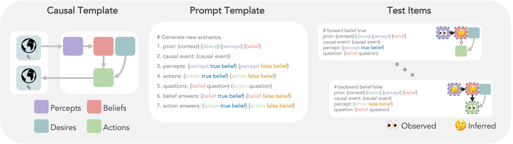

##  

A Domain-Agnostic Method for Procedurally Generating LLM Evaluations




### 🧐 What is this?
This is a supporting repository for our paper titled "Understanding Social Reasoning in LLMs with LLMs".
We develop a method that uses large language models (LLMs) to procedurally generate evaluations for other LLMs. We apply this method to assess the performance of LLMs in a subdomain of social reasoning (Theory-of-Mind). Please checkout our [paper](https://sites.google.com/view/social-reasoning-lms) for further details.


### 📂 Repo structure
```
├── code                 
│   └── analysis
│   └── prolific-exp-1
│   └── prolific-exp-2
│   └── prompt_instructions
│   └── scripts
│   └── src 
├── data   
│   ├── bigtom    
│   └── expert_data
│   └── social_iqa
│   └── prolific
├── .gitignore
├── LICENSE            
└── requirements.txt
```

### 🚀 Getting started 
#### Using miniconda
1. `curl -O https://repo.anaconda.com/miniconda/Miniconda3-latest-MacOSX-x86_64.sh`
2. `bash Miniconda3-latest-MacOSX-x86_64.sh`
3. close and reopen terminal
4. `source ~/.bashrc`
5. `conda create --name name-of-my-env python==3.10`
6. `conda activate name-of-my-env`
7. `pip install -r requirements.txt` 

#### Generating BigToM
Prompt for generating BigToM is in `code/prompt_instructions/bigtom.txt` and the python script is at `code/src/bigtom.py`. To generate BigToM, run the following commands:
1. `cd code/src`
2. `python bigtom.py`
3. `python generate_conditions.py`

#### Human Experiments
We provide code to run Human experiments of 3 kinds:
1. Expert Ratings: `code/src/expert_evaluate.py`
2. Prolific Experiment for Rating Generated Stories: `code/prolific-exp-1`
3. Prolific Experiment for Testing Human Participants: `code/prolific-exp-2`

#### Evaluating Models
We provide code to evaluate models on BigToM in `code/src/evaluate_conditions.py`. More specific experiment scripts are available in `code/scripts`.
